<h1 align="center">Data Mining for COVID-19</h1>

## 📝 **Project Details:**
Taking a data mining approach to understand a COVID-19 dataset, and using machine learning to make predictions.

## ❓ **Problem:**
The number of infected cases continue to rise everyday. Find a way to predict if patients will be hospitalized, deceased or recovered based on the given dataset.

## ✔️ **Solution:**
1. Data Analysis and Preprocessing
2. Data visualizations
3. Creating and tuning ML models
4. Predicting with ML models

- ### Libraries:
    * Models: AdaBoost and RandomForest
    * Preprocessing: pandas, numpy, and scikit-learn
    * Visualization: matplotlib and seaborn

### 🤝 **Contributions:** 
1. **Kourosh:** preprocessing, analysis, visualizations, building models, and hyperparameter tuning, and documentation
2. **Julian:** preprocessing, building models, and documentation
3. **Robert:** preprocessing, documentation

### **Data Visualization and Reports:**

  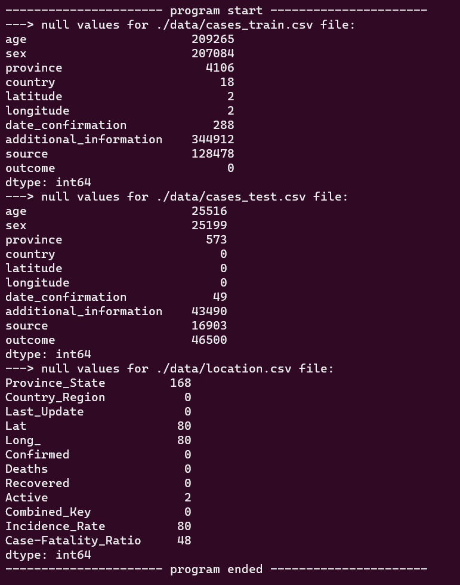
  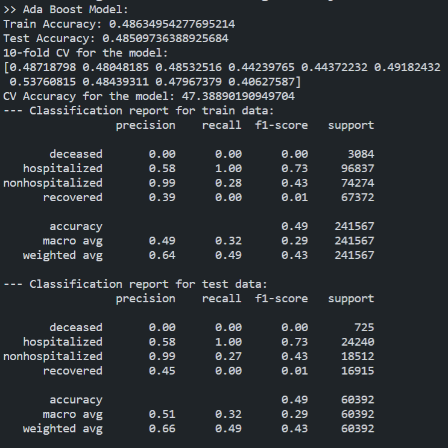
  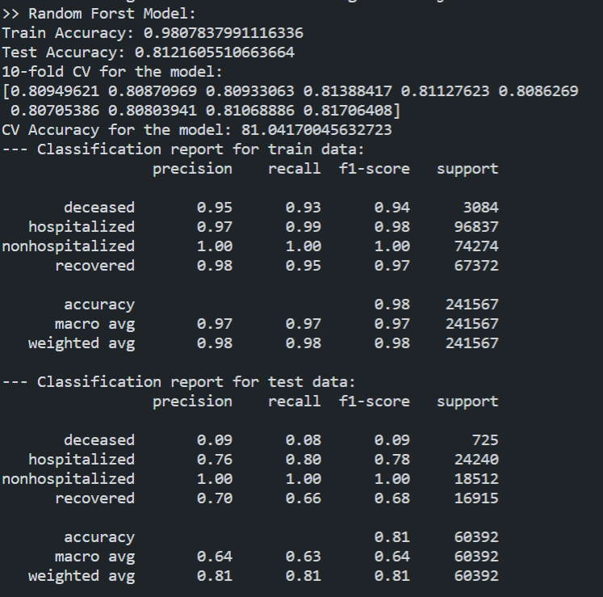
  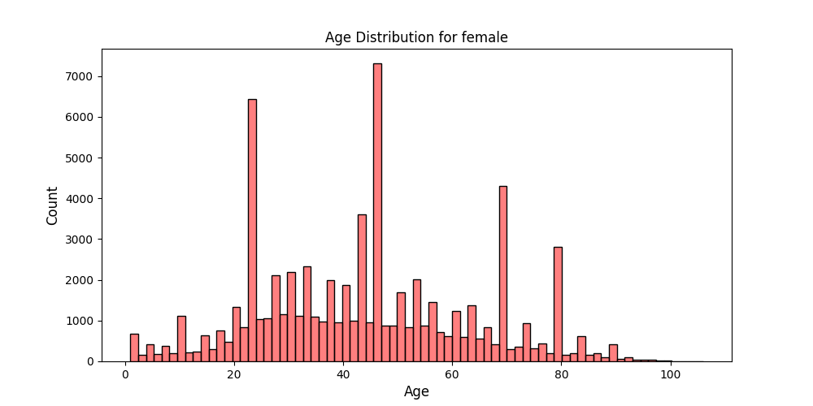
  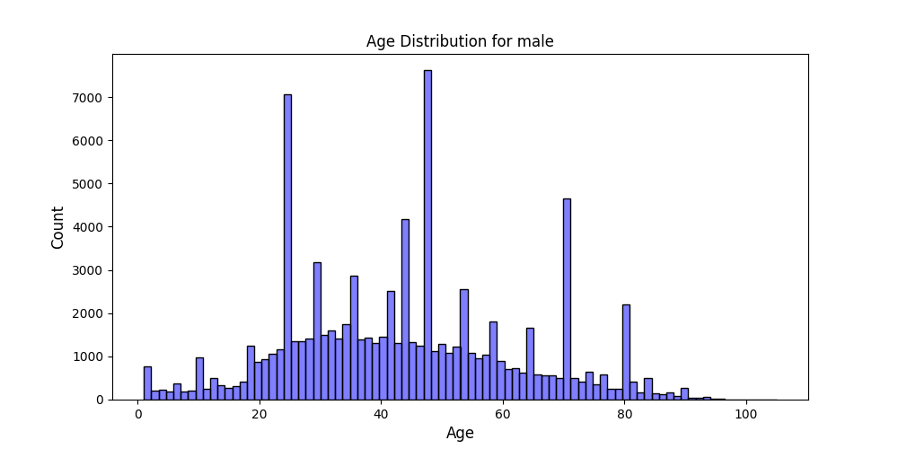
  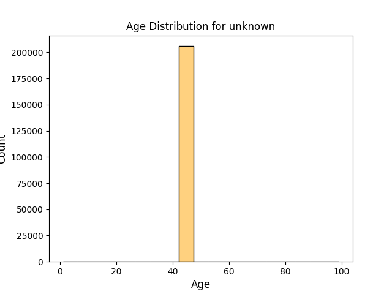
  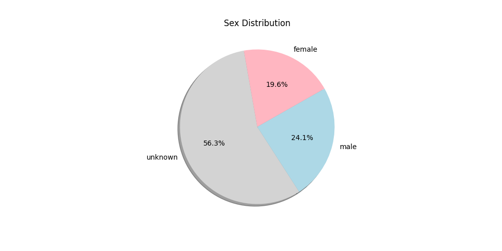
  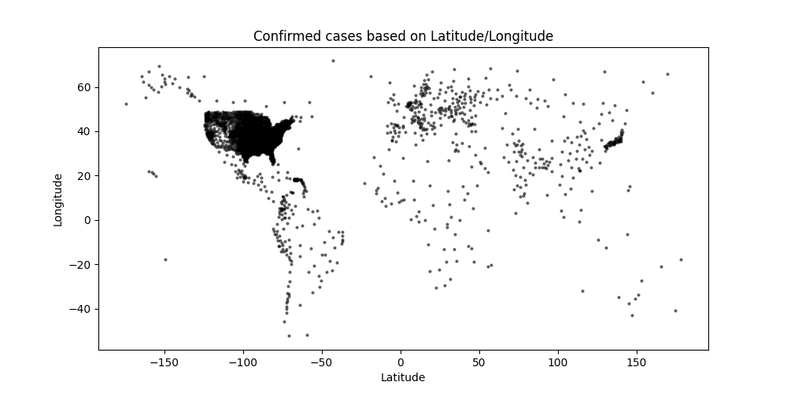
  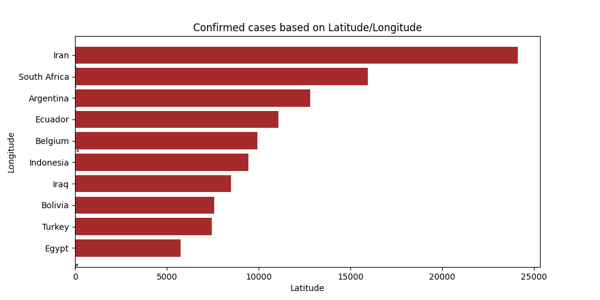
  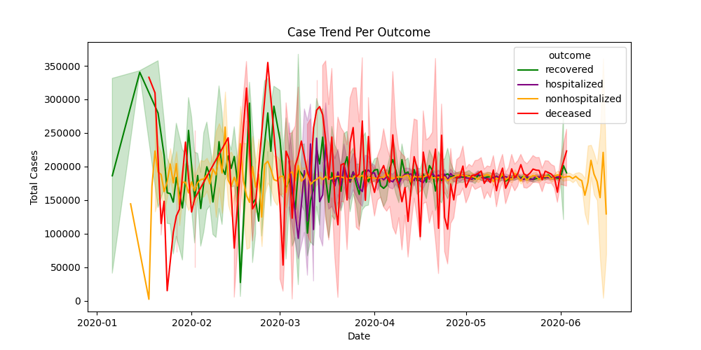
  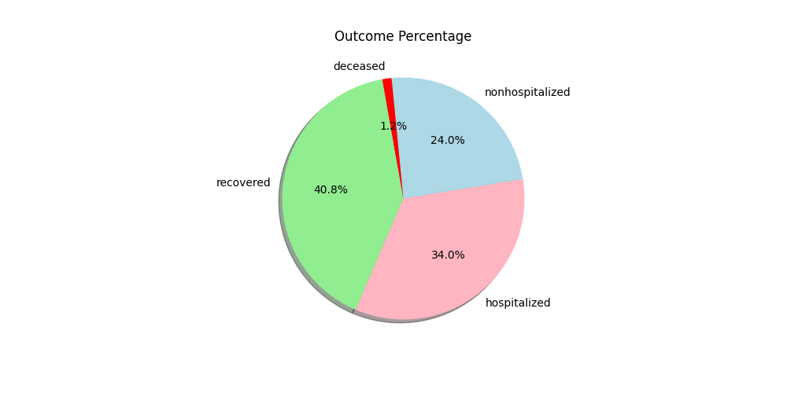

